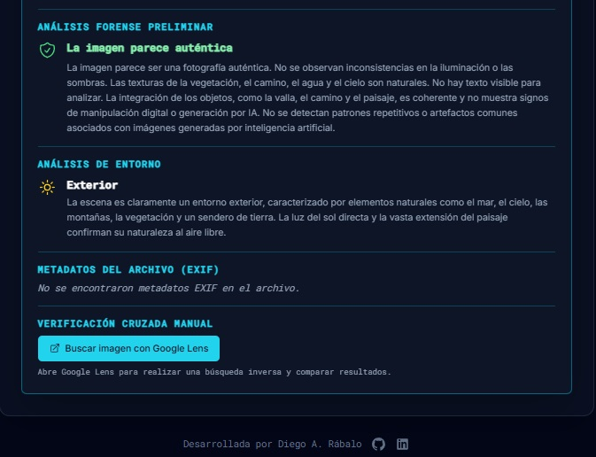

# GeOsint - Aplicación Web


Este repositorio contiene el código fuente de la aplicación web GeOsint, una herramienta de inteligencia geoespacial.

## Demo en Vivo

Puedes probar la aplicación en el siguiente enlace:

[https://geosint-web.vercel.app/](https://geosint-web.vercel.app/)

## Capturas de Pantalla

### Escaneo


### Resultados


### Informe


## Ejecutar Localmente

**Requisitos:** Node.js

1.  **Instalar dependencias:**
    ```bash
    npm install
    ```
2.  **Configurar la clave de API:**
    Crea un archivo `.env.local` en la raíz del proyecto y añade tu clave de API de Gemini:
    ```
    GEMINI_API_KEY=TU_API_KEY_AQUI
    ```
3.  **Ejecutar la aplicación:**
    ```bash
    npm run dev
    ```

## Autor

*   **mikear**